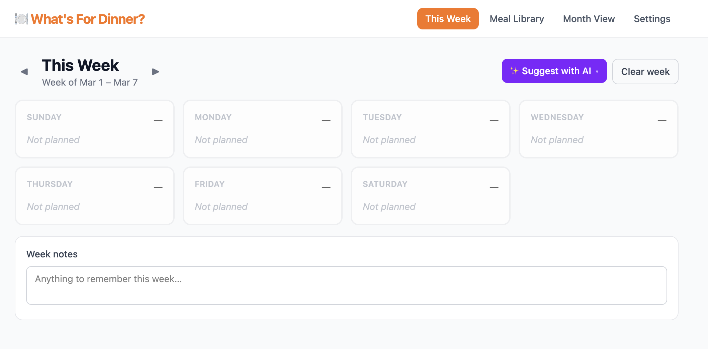

# What's For Dinner? 🍽️

A simple household meal planning webapp. Build a library of meals you actually like, plan the week in a 7-day grid, and optionally let AI draft the plan based on your history.

Designed to run on a home network behind Traefik — no auth, no cloud, no fuss.

[](https://hub.docker.com/r/brandonh317/whats-for-dinner)



---

## Features

- **Meal Library** — track every meal with notes, recipe link, protein type, cuisine tag, and flags like ⚡ easy-to-make and 📦 has-leftovers
- **Frozen Meal Inventory** — track homemade frozen meal prep portions with +/- quantity controls in the library and meal editor
- **Protein Inventory** — database-driven protein stock tracking (14 defaults auto-seeded); adjust quantities per serving and monitor what's on hand
- **Weekly planner** — a 7-day grid for dinners; click any day to set it as home-cooked, eating out, frozen, or unplanned
- **Week notes** — a free-text memo on each week (guests, theme, etc.); auto-saves on blur
- **Shopping list** — read-only view comparing planned meal needs vs current inventory (protein stock + frozen meal count)
- **AI suggestions** — Claude or GPT-4o drafts the week based on your history and library; three modes: 🎲 Mix it up (favour less-used meals), 🛡️ Play it safe (favour favourites), or 📦 On hand (only suggest meals with available protein/frozen stock)
- **Gym nights** — configure which nights you go to the gym; AI will prefer easy-to-make meals on those nights
- **📌 Carry-forward** — pin any day so its meal copies to the same day next week automatically
- **Past weeks** — browse previous plans to jog your memory
- **Offline-capable** — Alpine.js and Tailwind CSS are vendored into the Docker image at build time; no CDN or internet access required at runtime

---

## Quick Start

### 1. Copy and configure the environment file

```bash
cp .env.example .env
```

Edit `.env`:

```env
# AI provider: "anthropic", "openai", or "none" to disable AI suggestions
AI_PROVIDER=anthropic

# API key for whichever provider is active above
AI_API_KEY=sk-ant-...

# CORS: comma-separated allowed origins, or * for any (default: *)
# Set to your Traefik hostname in production:
# ALLOWED_ORIGINS=https://dinner.home
ALLOWED_ORIGINS=*

# Subnet restriction: comma-separated CIDRs, or unset to allow all clients
# ALLOWED_SUBNETS=192.168.1.0/24,10.0.0.0/8
```

AI is optional — set `AI_PROVIDER=none` to disable it entirely, or leave `AI_API_KEY` blank and the UI will tell you clearly it's not configured.

`ALLOWED_SUBNETS` is also optional. When set, only requests from those CIDR ranges are accepted (useful for locking the app to your LAN). The middleware checks `X-Real-IP` first (set by Traefik), then `X-Forwarded-For`, then the raw socket address.

### 2. Set your Traefik hostname

In `docker-compose.yml`, replace `HOSTNAME_PLACEHOLDER` with the hostname you want Traefik to route to this app:

```yaml
- "traefik.http.routers.dinner.rule=Host(`dinner.home`)"
```

### 3. Start the container

```bash
docker compose up -d
```

The app is served on port `8000`. If you're not using Traefik, you can expose it directly by adding a `ports` section:

```yaml
services:
  whats-for-dinner:
    ports:
      - "8000:8000"
```

Then visit `http://your-server-ip:8000`.

---

## Usage

### Setting up your meal library

Go to **Meal Library** and add the meals you cook regularly. For each meal you can record:

| Field | Description |
|---|---|
| Name | What you call it |
| Type | Home cooked / Eat out / Frozen / Other |
| Protein | Chicken, Beef, Fish, Tofu, etc. — used by AI to vary proteins across the week |
| Cuisine | Italian, Mexican, Asian, etc. — used by AI to avoid back-to-back same cuisines |
| ⚡ Easy to make | Low effort — good for after the gym |
| 📦 Has leftovers | Produces extra for the next day |
| Recipe link | URL to the recipe (opens in a new tab) |
| Notes | Anything useful — prep time, variations, etc. |
| Shared ingredients | Notes on ingredient overlap with other meals |
| Frozen quantity | Number of frozen portions available (frozen type only) |
| Protein servings | How many protein servings this meal needs (used for shopping list) |

### Planning the week

Click **This Week**. Each day starts as "Not planned." Click a day to set it:

- **Home cooked** — pick a meal from your library
- **Frozen** — pick a frozen meal (deducts from frozen inventory)
- **Eat out** — type where/what (e.g. "Chipotle", "Thai place")
- **No plan** — leave it unset

### Using AI suggestions

Once you have some meals in the library, click **✨ Suggest with AI** and pick a mode:

- **🎲 Mix it up** — favours meals you haven't had recently or at all. Good for breaking out of a rut.
- **🛡️ Play it safe** — favours household favourites (high usage count). Good for a low-effort week.
- **📦 On hand** — only suggests meals with available protein stock or frozen portions. Good for using what you've got.

Claude (or GPT-4o) looks at your full meal library, the last 8 weeks of plans, and your configured gym/eat-out nights, then fills in all 7 days. Click any day afterward to adjust.

If AI isn't configured, the button will redirect you to Settings where you'll see setup instructions.

### Carry-forward (📌)

When editing a day, check **📌 Carry forward** to pin that meal or eat-out choice. When the next week's plan is created, any pinned days are automatically copied over — useful for standing weekly meals (e.g. "Taco Tuesday"). Carry-forward only fills days that haven't been explicitly set yet.

### Configuring gym nights

Go to **Settings** and select your gym nights. These are saved and applied to every new plan — the AI will prefer easy-to-make meals on those nights, and they're shown with a 🏋️ icon in the planner.

You can also configure default eat-out nights, which are pre-set to "Eating out" whenever a new plan is created.

---

## Stack

| Layer | Technology |
|---|---|
| Backend | Python 3.12 + FastAPI |
| Database | SQLite (file in a named Docker volume) |
| Frontend | Alpine.js + Tailwind CSS v4 (compiled at image build time via `@tailwindcss/cli`, node:22-slim build stage) |
| AI | Anthropic Claude `claude-sonnet-4-6` or OpenAI `gpt-4o` |
| Container | Single Docker image, docker-compose |

---

## Project Layout

```
whats-for-dinner/
├── app/
│   ├── main.py           # FastAPI app, middleware, access log
│   ├── database.py       # SQLAlchemy + SQLite setup
│   ├── models.py         # ORM models (Meal, WeeklyPlan, PlanDay, Setting, ProteinInventory)
│   ├── schemas.py        # Pydantic request/response schemas
│   └── routers/
│       ├── meals.py      # Meal library CRUD + frozen quantity adjustment
│       ├── plans.py      # Weekly plan CRUD + day updates + shopping list
│       ├── ai.py         # AI plan generation + status check
│       ├── inventory.py  # Protein inventory CRUD
│       └── settings.py   # Key-value settings store
├── static/
│   ├── index.html        # SPA shell
│   ├── app.js            # All Alpine.js frontend logic
│   └── css/
│       └── input.css     # Tailwind v4 CSS config: @import, @theme, @source inline() safelist
├── tests/                # pytest suite (123 tests, in-memory SQLite)
│   ├── test_frontend_assets.py  # static config checks (no CDN, safelist)
├── data/                 # SQLite db lives here (volume-mounted, gitignored)
├── package.json          # Node deps for the Tailwind build stage (tailwindcss, @tailwindcss/cli, alpinejs)
├── .env.example
├── docker-compose.yml
└── Dockerfile            # Multi-stage: Node builds CSS → Python serves everything
```

---

## API

The backend exposes a REST API at `/api/`. Useful endpoints:

```
GET    /api/meals                              List meal library
POST   /api/meals                              Add a meal
PUT    /api/meals/{id}                         Update a meal
PATCH  /api/meals/{id}/frozen-quantity?delta=N  Adjust frozen inventory count

GET    /api/plans/current                      Get (or create) this week's plan
PUT    /api/plans/{id}/days/{0-6}              Update a single day in a plan
PUT    /api/plans/{id}/notes                   Update week-level notes
GET    /api/plans/{id}/shopping-list           Generate shopping list vs inventory

GET    /api/inventory/proteins                 List protein inventory
POST   /api/inventory/proteins                 Add a protein entry
PUT    /api/inventory/proteins/{name}          Update a protein entry
PATCH  /api/inventory/proteins/{name}/adjust   Adjust quantity by delta
DELETE /api/inventory/proteins/{name}          Remove a protein entry

GET    /api/ai/status                          Check if AI is configured
POST   /api/ai/generate                        Generate a plan with AI

GET    /api/settings                           Read settings
PUT    /api/settings                           Update settings
```

Interactive docs are available at `http://your-host/docs` (FastAPI's built-in Swagger UI).

---

## Tests

The project has 123 tests covering meals, plans, inventory, settings, AI endpoints, security/access-log middleware, and frontend asset configuration. Each test runs against a fresh in-memory SQLite database — the production database is never touched.

### Run locally

You'll need Python 3.12. Create a virtual environment, install both dependency files, and run pytest:

```bash
python3.12 -m venv .venv
source .venv/bin/activate      # Windows: .venv\Scripts\activate
pip install -r requirements.txt -r requirements-test.txt
pytest
```

For a coverage report:

```bash
pytest --cov=app --cov-report=term-missing
```

### CI

On every push and pull request to `main`, GitHub Actions runs two jobs (see [.github/workflows/test.yml](.github/workflows/test.yml)):

- **test** — runs the full pytest suite; no API keys required (all AI calls are mocked)
- **docker** — builds the Docker image and verifies that `tailwind.css` and `alpine.min.js` were compiled into the image correctly

The weekly build check ([.github/workflows/weekly-build-check.yml](.github/workflows/weekly-build-check.yml)) runs the same Docker build against the latest unpinned dependencies to catch upstream breakage early. The publish workflow ([.github/workflows/docker-publish.yml](.github/workflows/docker-publish.yml)) also verifies frontend assets before pushing to Docker Hub.

---

## Data & Backups

All data is stored in a single SQLite file inside the `dinner-data` Docker volume. To back it up:

```bash
docker run --rm -v dinner-data:/data -v $(pwd):/backup alpine \
  tar czf /backup/dinner-backup.tar.gz /data
```

To restore:

```bash
docker run --rm -v dinner-data:/data -v $(pwd):/backup alpine \
  tar xzf /backup/dinner-backup.tar.gz -C /
```
