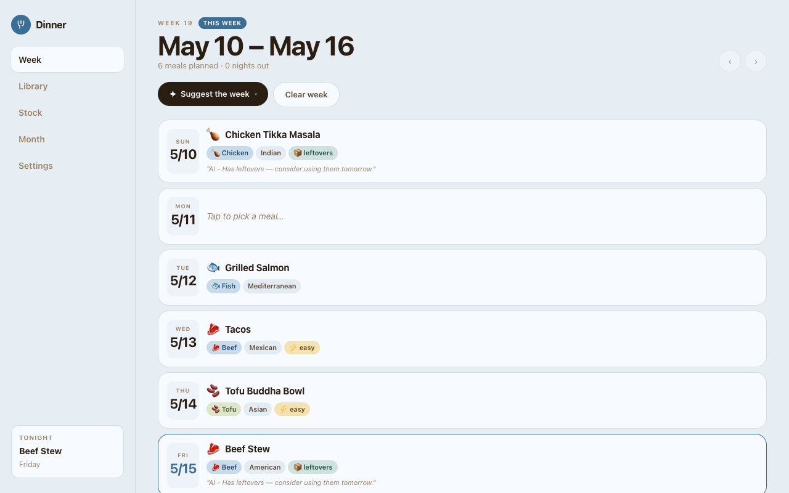

# What's For Dinner?

A self-hosted meal planning app for households. Build a library of meals you actually cook, plan the week on a 7-day grid, track your protein and frozen meal inventory, and optionally let AI fill in the plan based on your history and preferences.

Runs on your home network with no authentication, no cloud dependency, and no external assets at runtime.

[](https://hub.docker.com/r/brandonh317/whats-for-dinner)



---

## Features

### Meal library
Add every meal your household knows and likes. Each entry tracks the meal name, type (home cooked, eat out, frozen, or other), protein, cuisine, recipe link, notes, whether it's easy to make, whether it produces leftovers, shared ingredients with other meals, how many protein servings it requires, and frozen portion count for frozen meals.

### Weekly planner
A Sunday-through-Saturday dinner grid. Click any day to assign it:

- **Home cooked** — pick from your meal library
- **Frozen** — pick a frozen meal (deducts from inventory)
- **Eat out** — enter a restaurant or cuisine (e.g. "Chipotle")
- **Other** — free-text note (e.g. "Leftovers", "Travel")

Add a free-text memo to the whole week for context like guests or themes. Browse past weeks with the navigation arrows to review what you've made before. A month-view calendar lets you jump to any week at a glance.

### Inventory tracking
- **Protein inventory** — 14 default protein types auto-seeded on first run (chicken, beef, shrimp, etc.). Track how many servings you have on hand. The shopping list uses this to calculate what you need to buy.
- **Frozen meal inventory** — track homemade frozen meal prep portions with +/- controls directly in the library.

### Shopping list
A read-only view that compares what the current week's plan needs (protein servings and frozen portions) against what you have in inventory, and shows the shortages.

### AI suggestions
Claude or GPT-4o can draft the entire week for you. Three modes:

- **Mix it up** — weighted toward meals you haven't had recently
- **Play it safe** — weighted toward household favourites
- **On hand** — only suggests meals you have the protein or frozen stock for

The AI receives your full meal library, the last 8 weeks of history, your gym/eat-out night settings, any week or day notes you've written, and your custom instructions. AI-generated notes are prefixed with "AI - " and appended to existing notes rather than replacing them.

AI is entirely optional. The app works fully without it.

### Carry-forward
Pin any day so its assignment automatically copies to the same day next week. Useful for standing meals like "Taco Tuesday." Pinned days only fill in if the next week's day hasn't already been planned.

### Settings
- **Gym nights** — the AI prefers easy-to-make meals on these nights; shown with a gym icon in the planner
- **Default eat-out nights** — pre-set to "Eating out" whenever a new plan is created
- **AI provider** — select Anthropic, OpenAI, or Disabled directly in the UI. The `AI_PROVIDER` env var takes precedence if set.
- **AI API key** — paste your key directly in the UI; stored on the server and never returned by the API. The `AI_API_KEY` env var takes precedence if set.
- **Custom AI instructions** — free-text field sent with every AI request (dietary preferences, restrictions, cooking style)

### Smart home integration
`GET /api/plans/today` returns tonight's dinner as a plain-English string. Point a Home Assistant REST sensor at it, wire up a TTS script, and ask your Google Home "What's for dinner?"

### Data safety
- Automatic backup before every database migration
- Weekly backup on startup (one per calendar week, 5-week retention)
- Manual backup/export via the API at any time
- All data lives in a single SQLite file inside a Docker volume

### Other
- **Demo mode** — set `DEMO_MODE=true` to seed ~20 sample meals and protein inventory on first startup for quick testing
- **Fully offline** — Alpine.js and Tailwind CSS are compiled and vendored into the Docker image at build time; no CDN calls at runtime
- **Subnet restriction** — optionally lock access to specific CIDR ranges via `ALLOWED_SUBNETS`
- **Security headers** — X-Content-Type-Options, X-Frame-Options, Referrer-Policy, and Content-Security-Policy on every response

---

## Quick Start

### 1. Create your environment file

```bash
cp .env.example .env
```

Edit `.env` and set your AI provider and API key (or leave them out to run without AI):

```env
AI_PROVIDER=anthropic
AI_API_KEY=sk-ant-...
```

### 2. Start the container

**With Traefik** (set `APP_HOSTNAME` in your `.env`):

```bash
docker compose up -d
```

**Without Traefik** (direct port mapping):

```bash
docker compose -f docker-compose.local.yml up -d
```

Visit `http://localhost:8000`. The local compose file enables demo mode by default so you'll have sample data to explore.

### 3. Add your meals

Go to the Library tab and start adding meals. Once you have a few, head to Week and either plan manually or let AI suggest the week.

---

## Environment Variables

| Variable | Default | Description |
|---|---|---|
| `AI_PROVIDER` | `anthropic` | `anthropic`, `openai`, or `none` — overrides the Settings UI selector if set |
| `AI_API_KEY` | — | API key for the configured provider — overrides the Settings UI value if set |
| `APP_PORT` | `8000` | Port inside the container |
| `APP_HOSTNAME` | `dinner.home` | Hostname for Traefik routing |
| `ALLOWED_ORIGINS` | `*` | CORS allowed origins (comma-separated) |
| `ALLOWED_SUBNETS` | _(all)_ | Restrict access to these CIDRs |
| `DEMO_MODE` | `false` | Seed sample meals and inventory on first startup |

---

## Stack

| Layer | Technology |
|---|---|
| Backend | Python 3.12, FastAPI, SQLAlchemy 2.0 |
| Database | SQLite (single file in a Docker volume) |
| Frontend | Alpine.js, Tailwind CSS v4 |
| AI | Anthropic Claude (`claude-sonnet-4-6`) or OpenAI (`gpt-4o`) |
| Container | Multi-stage Dockerfile (Node builds CSS, Python serves everything) |

---

## Project Layout

```
whats-for-dinner/
├── app/
│   ├── main.py           # FastAPI app, middleware, router registration
│   ├── database.py       # SQLAlchemy engine, migrations, backup logic
│   ├── models.py         # ORM models (Meal, WeeklyPlan, PlanDay, Setting, ProteinInventory)
│   ├── schemas.py        # Pydantic request/response schemas
│   └── routers/
│       ├── meals.py      # Meal library CRUD + frozen quantity adjustment
│       ├── plans.py      # Weekly plan CRUD, day updates, shopping list
│       ├── ai.py         # AI plan generation
│       ├── inventory.py  # Protein inventory CRUD
│       ├── backup.py     # Database backup and export
│       └── settings.py   # Key-value settings store
├── static/
│   ├── index.html        # Single-page app shell
│   ├── app.js            # All frontend logic (Alpine.js)
│   └── css/
│       └── input.css     # Tailwind v4 source config
├── tests/                # 193 tests (pytest, in-memory SQLite)
├── docker-compose.yml    # Production compose (Traefik)
├── docker-compose.local.yml  # Local dev compose (port mapping + demo mode)
├── Dockerfile            # Multi-stage build
├── .env.example          # Environment variable template
└── docs/
    └── ARCHITECTURE.md   # Detailed architecture reference
```

---

## API

All endpoints are under `/api/`. Interactive Swagger docs are available at `/docs`.

```
Meals
  GET    /api/meals                              List active meals
  POST   /api/meals                              Create a meal
  GET    /api/meals/{id}                         Get a meal
  PUT    /api/meals/{id}                         Update a meal
  DELETE /api/meals/{id}                         Soft-delete a meal
  PATCH  /api/meals/{id}/frozen-quantity?delta=N  Adjust frozen portion count

Plans
  GET    /api/plans                              List all plans
  GET    /api/plans/current                      Get or create this week's plan
  GET    /api/plans/today                        Tonight's dinner (natural language)
  GET    /api/plans/week/{date}                  Get or create plan for a specific week
  POST   /api/plans                              Create a plan
  GET    /api/plans/{id}                         Get plan with all days
  PUT    /api/plans/{id}/days/{0-6}              Update a single day
  PUT    /api/plans/{id}/notes                   Update week notes
  PUT    /api/plans/{id}/status                  Update plan status
  DELETE /api/plans/{id}                         Delete a plan
  GET    /api/plans/{id}/shopping-list           Generate shopping list

Inventory
  GET    /api/inventory/proteins                 List protein inventory
  POST   /api/inventory/proteins                 Add a protein
  PUT    /api/inventory/proteins/{name}          Update a protein
  PATCH  /api/inventory/proteins/{name}/adjust   Adjust quantity
  DELETE /api/inventory/proteins/{name}          Remove a protein

AI
  GET    /api/ai/status                          Check if AI is configured
  POST   /api/ai/generate                        Generate a plan with AI

Backup
  POST   /api/backup                             Create and download a backup
  GET    /api/backup/list                        List available backups
  GET    /api/backup/download/{filename}         Download a specific backup

Settings
  GET    /api/settings                           Read all settings
  PUT    /api/settings                           Update settings
```

---

## Testing

208 tests covering meals, plans, inventory, settings, AI, security middleware, database migrations, demo mode, and frontend asset configuration. Every test runs against a fresh in-memory SQLite database.

```bash
# Set up
python3.12 -m venv .venv
source .venv/bin/activate
pip install -r requirements.txt -r requirements-test.txt

# Run
pytest
```

Coverage is enforced at 90% minimum via `pytest.ini`. CI runs the full test suite plus a Docker build verification on every push and PR.

---

## Data & Backups

All data lives in a single SQLite file inside the `dinner-data` Docker volume.

**Manual volume backup:**
```bash
docker run --rm -v dinner-data:/data -v $(pwd):/backup alpine \
  tar czf /backup/dinner-backup.tar.gz /data
```

**Restore:**
```bash
docker run --rm -v dinner-data:/data -v $(pwd):/backup alpine \
  tar xzf /backup/dinner-backup.tar.gz -C /
```

The app also creates its own backups automatically before migrations and weekly on startup, and you can trigger a manual backup through the API at `POST /api/backup`.

---

## Docker Hub

Pre-built images are available on Docker Hub: [brandonh317/whats-for-dinner](https://hub.docker.com/r/brandonh317/whats-for-dinner)

---

## License

MIT
